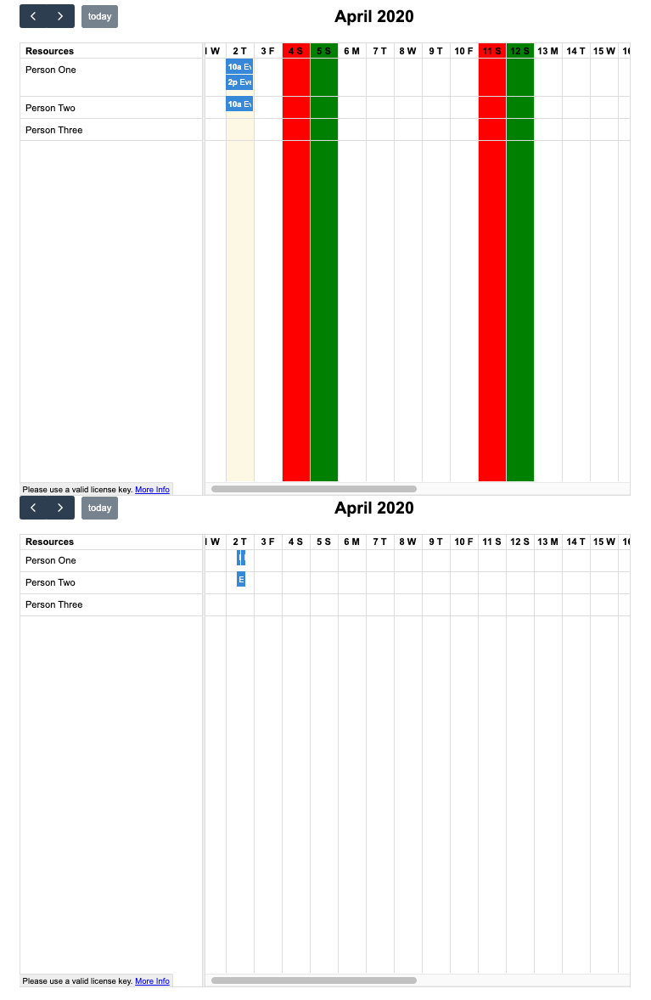

# FullCalendar Issue

This is sample code for an issue I logged at [fullcalendar-vue](github.com/fullcalendar/fullcalendar-vue).  It is based on the [FullCalendar Vue Example Project](https://github.com/fullcalendar/fullcalendar-example-projects/tree/master/vue) with some minor modifications.

The issue experienced is that when adding a slotLabelInterval on a resource timeline, the classes for the weekdays disappear so I am unable to apply separate styling for weekends.

Without and with slotLabelInterval:




# FullCalendar Vue Example Project

This is a fully-buildable example project for FullCalendar and Vue, leveraging Webpack and Sass. For a complete walkthrough, read the [FullCalendar Vue Docs &raquo;](https://fullcalendar.io/docs/vue)

## Installation

```bash
git clone https://github.com/fullcalendar/fullcalendar-example-projects.git
cd fullcalendar-example-projects/vue
npm install
```

## Build Commands

```bash
npm run build
npm run watch # continously build
npm run clean # start fresh
```

After running `build` or `watch`, open up `index.html` in a browser.
